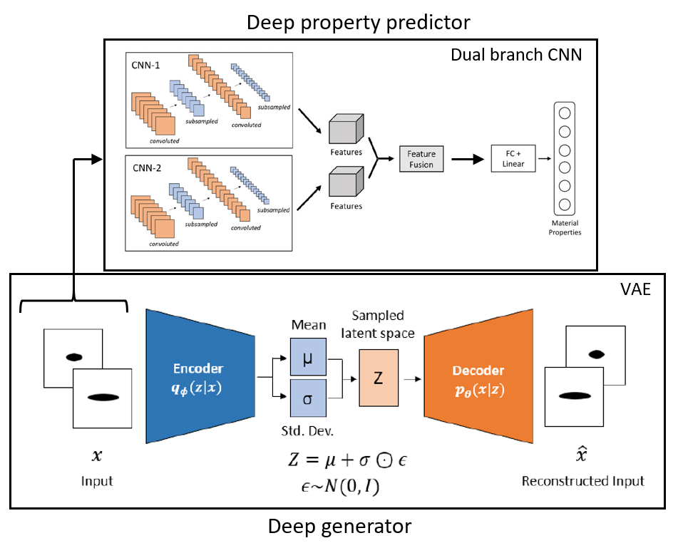

# VAE based discovery of composite materials
#### *Research statement*: AI-accelerated property prediction, discovery, and design of materials have emerged as a new research front with many promising features. There are many investigations on different materials, but no emphasis is placed on composite materials. Among many challenges, the unavailability of datasets for composite materials is a significant roadblock. This is because conducting multiple experiments is costly and cumbersome, and performing simulations is time-taking and demands computational resources. In order to accelerate and scale the prediction, discovery, and design, a deep generation approach is proposed for composite materials. The current research requires limited physical simulations to train a deep generator network. The generator can generate enormous data, eliminating the demerits of both experiments and simulations. The work is novel in terms of the deep generation approach as well as the applications for composite materials.

<p align="center">
  
</p>


* Check out the [published article](https://ieeexplore.ieee.org/abstract/document/9991053) and the [arxiv version](https://arxiv.org/abs/2212.06365).
* The dataset for the paper and the code is available at Zenodo <a href="https://doi.org/10.5281/zenodo.7301863"></a>. 
* The inverse material property estimator work is available [here](https://doi.org/10.1080/15376494.2021.1982090). Check out the associated [respository](https://github.com/mahindrautela/MatChar_dualCNN)

------------------------------------------------------------------------------------------------------------------------------------------------------
Basic Details:
* The code is made on Python programming language using Tensorflow 2.x
* The instruction to use the dataset is described in the 'DatasetInformationDocument.pdf'
* For more information, you can write to me at my email id mahindrautela@gmail.com.
* Please cite the paper if you are using the dataset, code or paper.
```
@ARTICLE{9991053,
  author={Rautela, Mahindra and Senthilnath, J. and Huber, Armin and Gopalakrishnan, S.},
  journal={IEEE Transactions on Artificial Intelligence}, 
  title={Toward Deep Generation of Guided Wave Representations for Composite Materials}, 
  year={2024},
  volume={5},
  number={3},
  pages={1102-1109},
  keywords={Computational modeling;Composite materials;Propagation;Predictive models;Mathematical models;Material properties;Generators;Composite materials;deep generative model;variational autoencoder (VAE);wave propagation},
  doi={10.1109/TAI.2022.3229653}}
```
